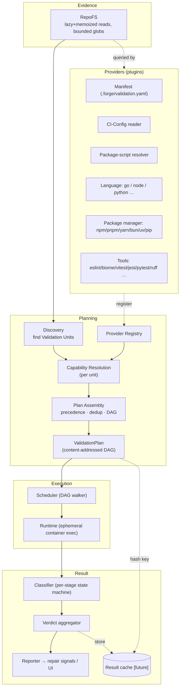
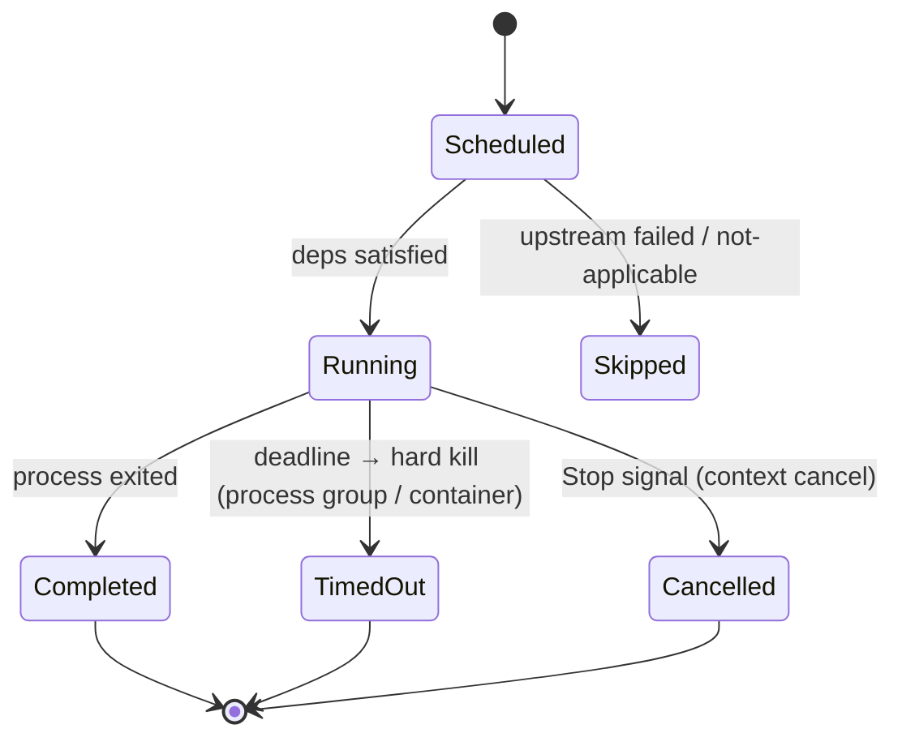
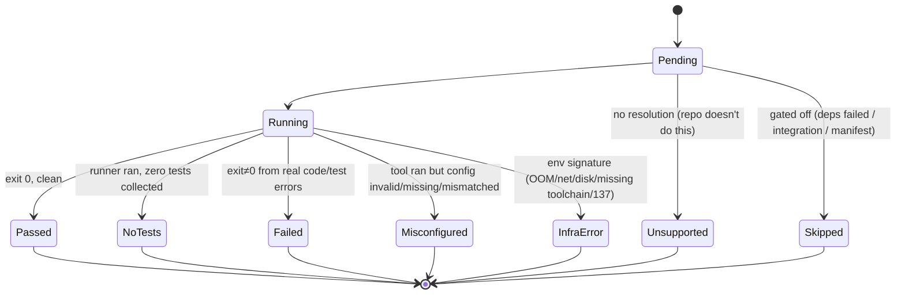

# Next-Generation Validation Engine — Architecture Review

Status: **DRAFT for review** — no code until agreed.
Scope: replacement for `backend/internal/validation` (static profiles + fixed detection).

---

## 0. What we are actually building

Not "a thing that runs lint/test/build." A **planner that understands a repository the way the repository understands itself, produces a deterministic execution plan, runs it with correct process semantics, and emits results a repair agent can trust.** Command execution is the cheap part; *deciding what is legitimate to run* is the hard part and the whole point.

Design tenets (ranked — higher wins on conflict):

1. **Conventions over inference over assumption.** What the repo declares > what we infer > what we guess. We never guess.
2. **Determinism.** Same commit → same plan → same classification. No network, no `npx` downloads, no clocks in the plan.
3. **Honest ignorance.** Absence of a signal yields `Unsupported`/`Skipped`, never a fabricated command.
4. **Evidence is shared and cheap.** The filesystem is read once, lazily, and memoized. No component re-scans.
5. **Everything is a plugin.** New language/PM/linter = register a provider. No switch statements, no static profile map.

---

## 1. Critique of the v1 proposal (Probe → Plan → Execute → Classify)

I'm rejecting or reshaping four parts of my own earlier proposal:

| v1 idea | Weakness found | Replacement |
|---|---|---|
| **`RepositoryInspector`** produces a fixed `RepositoryProfile` struct | God-object + static-schema trap: every new tool grows the struct; forces scanning for things no one needs; centralizes knowledge that belongs in plugins | **Evidence layer** (cached, lazy `RepoFS`) that *plugins query on demand*. No omniscient profile struct. |
| **Single `ValidationPlanner`** | Conflates three concerns (which projects exist, which tools apply, how stages order) | Split into **Discovery → Resolution → Assembly**. |
| Implicitly **one project per repo** | Breaks on monorepos, workspaces, cross-language repos | Introduce the **Validation Unit** as the core noun. Plans are per-unit, composed. |
| Plan as an ordered list | Can't express parallelism, caching, incrementality, or distribution | Plan as a **content-addressed DAG**. |

Two ideas I'm *adding* that v1 missed entirely:

- **The repository's own CI config is ground truth.** `.github/workflows/*.yml`, etc., literally encode "how this repo validates itself." A provider that reads them (as a *hint*, confidence-scored) beats any inference.
- **An optional forge manifest** (`.forge/validation.yaml`) as the top of the precedence ladder — an escape hatch for repos we get wrong, and the mechanism autonomous runs can *write back* once a plan is confirmed.

---

## 2. High-level architecture

Four planes, each with one responsibility. Data flows down; nothing flows back up except results.

```
 ┌──────────────────────────────────────────────────────────────────┐
 │ EVIDENCE PLANE     RepoFS: lazy, memoized reads / bounded globs    │
 │                    (the ONLY thing that touches the filesystem)    │
 └──────────────────────────────────────────────────────────────────┘
              ▲ queried by                         (never re-scanned)
 ┌──────────────────────────────────────────────────────────────────┐
 │ PLANNING PLANE                                                     │
 │   Discovery ─→ [Validation Units]                                  │
 │   Resolution (per unit): Provider Registry → Capability Resolutions│
 │   Assembly: precedence + dedup + DAG + timeouts → ValidationPlan   │
 └──────────────────────────────────────────────────────────────────┘
              │ ValidationPlan (content-addressed DAG, no side effects)
 ┌──────────────────────────────────────────────────────────────────┐
 │ EXECUTION PLANE   Scheduler → Runtime (container/exec) per Stage   │
 │                   process semantics, timeout, cancel, cleanup      │
 └──────────────────────────────────────────────────────────────────┘
              │ raw StageOutcome stream
 ┌──────────────────────────────────────────────────────────────────┐
 │ RESULT PLANE      Classifier (state machine) → Verdict → Reporter  │
 │                   + Cache (keyed by plan hash) [future]            │
 └──────────────────────────────────────────────────────────────────┘
```

The critical property: **the Planning plane is pure** (evidence in → plan out, no execution), so a plan can be inspected, hashed, cached, diffed, and shipped to a remote worker without running anything.

---

## 3. Component diagram



---

## 4. Data flow

1. **RepoFS** is constructed for a workspace. It exposes `read(path)`, `exists(path)`, `glob(pattern, maxDepth)` — all memoized. Nothing else in the system reads the filesystem.
2. **Discovery** asks RepoFS for a *small, fixed* set of root markers (`package.json`, `go.mod`, `pyproject.toml`, workspace/monorepo markers) and emits **Validation Units** — each a `{path, candidateLanguages}` project root. One repo → 1..N units.
3. For each unit, **Resolution** runs the **Provider Registry**. Each provider is handed the unit + RepoFS and returns zero or more **Capability Resolutions** (`install|build|typecheck|lint|test` → concrete command + execution mode + support-state + confidence + provenance).
4. **Assembly** applies the **precedence ladder**, dedups competing resolutions (two linters → repo script wins), orders capabilities into a **DAG**, assigns timeouts/semantics, and hashes the result into a deterministic **ValidationPlan**.
5. **Scheduler** walks the DAG; **Runtime** executes each stage in the ephemeral validation container with correct process semantics and streams raw outcomes.
6. **Classifier** maps each raw outcome to a typed **StageOutcome**; **Verdict aggregator** folds per-unit and repo verdicts; **Reporter** emits structured results + repair signals. **Cache** (future) short-circuits from step 5 when `(commit, plan hash, tool versions)` is unchanged.

---

## 5. Responsibilities (one sentence each)

- **RepoFS (Evidence):** the single, memoized gateway to repository files; enforces bounded scanning; guarantees "read once."
- **Discovery:** find project roots (Validation Units); own monorepo/workspace/cross-language topology. Knows *where* projects are, nothing about *how* to validate them.
- **Provider (plugin):** a self-contained unit of knowledge about one thing (a language, a PM, a linter, CI config, the manifest). Declares the signals it needs; detects relevance; resolves capabilities to commands. The *only* place tool-specific knowledge lives.
- **Provider Registry:** holds registered providers; deterministic iteration order; no logic.
- **Resolution:** run providers over a unit, collect resolutions. No decisions about conflicts yet.
- **Assembly:** apply precedence, resolve conflicts, build the DAG, assign semantics/timeouts, compute the plan hash. Produces the immutable plan.
- **ValidationPlan:** a pure, serializable, content-addressed description of what to run. No behavior.
- **Scheduler:** walk the DAG honoring dependencies and (future) parallelism/isolation constraints.
- **Runtime:** run one command with correct env/TTY/stdin/timeout/cleanup. Knows nothing about tools — a dumb, correct process runner.
- **Classifier:** turn raw exit/output/signal into a typed StageOutcome via an explicit state machine. Owns the passed/failed/skipped/unsupported/misconfigured/no-tests/infra distinction.
- **Verdict aggregator:** fold stage outcomes into unit and repo verdicts and the repair signal.
- **Reporter:** persist + emit outcomes and diagnostics.
- **Cache [future]:** memoize verdicts by plan hash.

Clean separation test: *adding Biome touches only a provider; adding monorepo support touches only Discovery; fixing the timeout kill touches only Runtime; changing what "misconfigured" means touches only Classifier.* No cross-cutting edits.

---

## 6. Validation planning lifecycle


**Precedence ladder** (per capability, highest wins — this is the correctness core):

1. **Forge manifest** `.forge/validation.yaml` — explicit human/agent intent.
2. **Repo CI config** — parsed commands from `.github/workflows`, etc. (hint; confidence-scored).
3. **Repo package scripts** — `pm run <script>` when `scripts.{lint,test,build}` exist. The repo's declared convention.
4. **Installed-tool inference** — only when *both* the tool dependency **and** a matching config are present (ESLint dep + resolvable flat/legacy config; vitest dep; pytest + config).
5. **Otherwise** → `Unsupported` or `Skipped`. Never invent a command, never `npx`-download.

Determinism guarantees: plan is a pure function of repo bytes; providers iterate in a fixed order; tool versions are pinned from lockfiles; the plan hash covers `{unit path, resolved commands, tool versions, provider set version}`. No network, no timestamps.

---

## 7. Execution lifecycle



**Execution modes** (declared per resolution, not guessed at runtime):

- **OneShot** — expected to exit (build, `go test`, `jest --ci`). Timeout = real failure signal.
- **Service / LongRunning** — never exits by design (dev servers, `cypress open`). Default **not scheduled**; only run under an explicit integration capability with readiness+teardown.
- **Interactive** — would wait on a TTY (watch-mode runners). **Neutralized** before running: inject `CI=true`, capability-normalized non-watch flags (jest `--ci --watchAll=false`, vitest `run`, react-scripts via `CI`), **close stdin**, **no TTY**.

Process correctness (fixes today's real bugs):
- **Real cleanup:** on timeout/cancel, terminate the whole process group / stop the ephemeral container — *not* a second `ExecStart` (today's no-op). Ephemeral one-container-per-run (or per-unit) makes hard kill safe.
- **Cancellation** integrates with the existing pipeline context registry (Stop).
- **Isolation for future parallelism:** lint/typecheck are read-only and parallelizable after `build`; test may write and is serialized per unit; units are parallelizable across separate working copies. The DAG encodes these edges; the Scheduler starts sequential and gains parallelism behind an isolation flag without touching providers or the classifier.

---

## 8. Result classification lifecycle

The repair engine must **never** receive a misleading failure. Each stage resolves to exactly one terminal state, with a defined trigger and downstream meaning:



| Outcome | Trigger | Blocks publish? | Repair signal |
|---|---|---|---|
| **Passed** | exit 0, output clean | no | none |
| **Failed** | exit≠0 attributable to code/tests | yes | **repairable** + diagnostics |
| **NoTests** | test runner ran, collected 0 | no | informational (not a failure) |
| **Skipped** | intentionally not run (cascade/integration/manifest) | no | none |
| **Unsupported** | no legitimate resolution for this capability | no | none |
| **Misconfigured** | tool present but config invalid/missing/version-mismatch | no (advisory) | **config-level**, not code — optionally repair config; never treat as code bug |
| **InfraError** | matches environment signature (network/OOM/disk/missing toolchain, SIGKILL 137) | no | **retry/escalate**, never "repair code" |

**Verdict aggregation:** repo verdict = the worst *actionable* outcome. `Failed` ⇒ repairable. `InfraError` ⇒ retry/escalate. `Misconfigured/Unsupported/Skipped/NoTests` are **non-blocking and non-code-repairable** — this is exactly the class that produced the false "import is reserved" failures today. Classification is attributed with **origin** (code vs config vs environment vs tooling) so the repair loop targets the right layer.

---

## 9. Extension mechanism

A provider is a small interface (conceptual, not final Go):

```
Provider:
  Kind()      → language | packageManager | tool | manifest | ci
  Signals()   → declarative list of files/globs it needs (batched by RepoFS)
  Detect(unit, evidence)                 → Claim{relevant, confidence}
  Resolve(capability, unit, evidence)    → []Resolution{command, mode, supportState, timeout, provenance}
```

- Providers are **registered** into the registry (a slice), never referenced by a switch.
- They **declare their signals** so RepoFS can batch reads and no provider scans independently (performance + determinism).
- Adding a linter (Biome/Oxlint), a PM (bun), a runner (Ava/node --test), or a language = **add one provider + register it**. Zero edits to Discovery, Assembly, Runtime, or Classifier.
- Providers are **pure** (evidence → resolutions), which makes them unit-testable in isolation with fixture repos.

---

## 10. Comparison to modern CI/CD & autonomous agents

| System | What we borrow | What we do differently |
|---|---|---|
| **GitHub Actions / GitLab CI / CircleCI** | Explicit config authority; matrix/stages concept | They *require* human config; we must **infer** — so we add the manifest escape hatch **and read their CI config as a signal**. |
| **Nx / Turborepo / Bazel** | Task **DAG**, content-addressed **caching**, **affected**-project (incremental) detection | We adopt DAG + plan hashing + affected-unit scoping; we stay language-agnostic via providers rather than build-tool-specific graphs. |
| **Nix / reproducible builds** | Pin inputs; no network at plan time; deterministic outputs | We pin tool versions from lockfiles and forbid `npx` downloads. |
| **Devin / OpenHands / SWE-agent** | Run the repo's **own** scripts/CI; parse structured output; don't invent commands | We formalize this as the precedence ladder and a typed outcome taxonomy so the repair loop gets clean signals. |

Net: we're closest to **"Turborepo's task graph + Bazel's hermeticity + an agent's convention-following,"** minus a required config file, plus a rigorous outcome taxonomy that CI systems don't need but an autonomous repair loop absolutely does.

---

## 11. Migration strategy (strangler, no big-bang)

1. **Introduce the plan/outcome types + Runtime fixes behind the existing orchestrator.** First real win: correct process semantics (CI env, stdin close, hard-kill timeout) — kills the watch-mode hang regardless of the rest. Ships independently.
2. **Add RepoFS + Discovery + a Node provider set** producing a `ValidationPlan`; run the new planner in **shadow mode** (log the plan it *would* run, compare to the static profile) without executing it. Zero risk, high signal.
3. **Cut Node over** to the new engine behind a feature flag; keep the old path as fallback.
4. **Port Go and Python** as providers; delete the static profile map + `detector.go`.
5. **Layer in** manifest + CI-config providers, then classification origins into the repair loop.
6. **Later/optional:** cache, incremental (affected units), parallel execution, distributed scheduling — all enabled by the plan-as-DAG contract without re-architecting.

Each step is independently shippable and reversible.

---

## 12. Risks & trade-offs

| Risk | Severity | Mitigation |
|---|---|---|
| **Inference is probabilistic** — we mis-resolve a weird repo | med | Always degrade to `Unsupported`/`Skipped`, never guess; manifest override; shadow mode before cutover. |
| **CI-config parsing is fuzzy** (matrices, custom actions) | med | Treat as *hint* only, confidence-scored; never the sole authority; ranks below the manifest. |
| **Parallel execution races** on a shared workspace volume | high (if rushed) | Ship sequential first; parallelism only with read-only mounts (lint/typecheck) or per-unit copies; encoded as DAG isolation constraints. |
| **Cache invalidation** correctness | high | Opt-in, late; key on `(commit, plan hash, tool versions, image digest)`; conservative miss. |
| **Plugin layer over-abstraction** | med | Keep providers thin/declarative; no provider may touch the FS except via RepoFS; hard cap on provider responsibilities. |
| **Probe latency** on huge repos | low–med | Bounded-depth globs, memoization, provider-declared signals so we read only what's needed; Discovery reads a tiny fixed marker set. |
| **Determinism erosion** via environment drift | med | Pin tool versions; hermetic sandbox images; plan excludes anything time/network-derived. |

Explicit trade-off accepted: **more moving parts than the static profile map.** Justified because the current simplicity is *false* — it "works" only for the one repo shape it hardcodes and silently misfires on everything else. The plane/provider split is the minimum structure that makes correctness and extensibility achievable; we resist adding anything beyond it until a real need appears (cache/parallel/distributed are deferred, not built upfront).

---

## 13. Final recommended architecture (the decision)

- **Four planes:** Evidence · Planning · Execution · Result — Planning is pure and side-effect-free.
- **Core noun:** the **Validation Unit** (project root); repos are 1..N units → monorepo/cross-language/workspaces fall out naturally.
- **Knowledge lives in Providers** (plugins) discovered via a registry — no switches, no static profiles.
- **Evidence is a single memoized RepoFS**; providers declare signals; the FS is read once.
- **Correctness ladder:** manifest > CI config (hint) > repo scripts > tool-inference (dep+config) > Unsupported/Skipped. No dynamic tool downloads.
- **Plan is a content-addressed DAG** — enabling determinism now and caching/incremental/parallel/distributed later without re-architecture.
- **Runtime is a dumb, correct process runner** with declared execution modes, non-interactive neutralization, and real timeout/cancel/cleanup.
- **Classifier is an explicit state machine** producing the 7-state outcome taxonomy with failure *origin*, so the repair engine never sees a misleading failure.

## 14. Finalized decisions (agreed)

1. **Validation Unit abstraction: yes, from day one.** v1 executes only the common **single-unit** case; multiple units must be additive later with **no redesign** (no full monorepo scheduling in v1).
2. **CI-config provider: deferred** (post-stability). v1 precedence ladder is exactly:
   1. Forge Manifest (when present)
   2. Repository package/build scripts
   3. Tool inference (dependency **+** configuration)
   4. Unsupported / Skipped
3. **Forge Manifest: yes, but no autonomous write-back in v1.** Flow: repo inferred → Forge *proposes* a manifest → human reviews → human commits. Auto write-back reconsidered once accuracy is proven.
4. **Container lifecycle: one ephemeral container per Validation Unit.** Stages within a unit may share that container; containers are isolated **across** units. Better isolation + cleanup + future parallelism.
5. **Repair-engine contract: structured signals only — never raw output.** Each result the repair orchestrator receives carries `{capability, outcome, failure_origin, diagnostics}`. Repair decisions are driven by `failure_origin`:
   - Code → repair code
   - Configuration → repair config or notify
   - Infrastructure → retry / escalate
   - Unsupported / Skipped → ignore
   - NoTests → informational only

**Deferred by explicit agreement** (architecturally supported, *not* built in the first milestone — they must not add v1 complexity): content-addressed DAG scheduling, caching, parallel scheduling, distributed execution. v1 optimizes strictly for **correctness, determinism, repository-awareness, extensibility**. The public architecture must let these layer on later without change.

## 15. Implementation phases (agreed order)

| Phase | Scope | Ships |
|---|---|---|
| **1** | **Runtime only** — correct timeout handling, real process cleanup, non-interactive execution (CI env, stdin closed, no TTY), reliable process lifecycle. No planning changes. | Immediately fixes watch-mode / hanging-process. Self-contained + reversible. |
| **2** | Introduce **RepoFS** + **Provider Registry**. New architecture, **no behavior change**. | Scaffolding only. |
| **3** | **Node providers** + planning pipeline → produce a `ValidationPlan`; keep profile execution live and run the planner in **shadow mode** (log/compare, don't execute). | Zero-risk validation of the planner. |
| **4** | Switch **Node** execution to the planner (feature-flagged, old path as fallback). | Node cutover. |
| **5** | Port **Go** and **Python** providers; delete static profile map + `detector.go`. | Full cutover. |
| **6** | **Forge Manifest** (propose → human commit). | Override mechanism. |
| **7** | **CI provider + caching + parallel execution** — only after the planner is proven stable. | Deferred capabilities. |

Guiding outcome: Forge stops being "a system that executes predefined commands" and becomes "a system that understands how a repository expects to be validated, generates a deterministic plan, executes it correctly, and returns structured outcomes an autonomous repair engine can trust."
